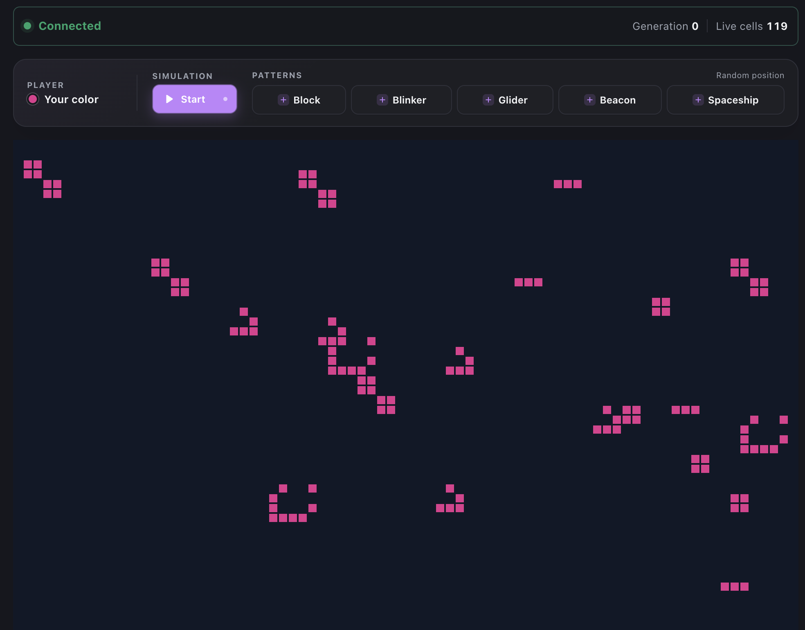

# Multiplayer Conway's Game of Life

A real-time Multiplayer Conway's Game of Life simulation. Every connected browser sees & edits the same exact board, receives a persistent player color, and can control the shared simulation.

The client side renders the board on a canvas. The Node.js server
owns the board, applies commands in arrival order, advances generations, and shows snapshots. Browser timing & local state are to never be the source of truth.





## The problem

A normal Game of Life implementation evolves a board locally. Making it multiplayer introduces several additions:

- all players must observe the same generation & cell state
- simultaneous edits must be applied in a deterministic order
- new & reconnecting clients must be able to catch up immediately
- untrusted network messages must not corrupt the simulation
- player ownership should remain visible as cells interact over time.

This service solves these problems with one game process. Node's event loop
serializes incoming commands, the server validates every message, and each
mutation increments a board revision before the resulting state is broadcast.
Surviving cells retain their color. A newborn cell receives the rounded RGB
average of its three live neighbors.

## Current behavior

- There is one shared bounded board. Its default size is 80 × 50 cells.
- The simulation starts paused and advances once per second by default while running.
- Any connected player can place a cell and can start or pause the shared simulation.
- Placing a cell on an occupied coordinate replaces its color.
- The Block, Blinker, Glider, Beacon, and Lightweight Spaceship patterns are supported. The server chooses a random valid origin for a requested pattern, and occupied cells covered by it are replaced.
- Every browser receives a randomly generated player color. A UUID stored in browser local storage preserves that color across reconnects for the lifetime of the server process.
- The board has hard edges. Cells outside it are treated as dead.
- A process restart clears the board, resets the generation, and forgets player colors.

## Architecture

```text
Browser(s)                    Public origin                    Game service
React + canvas  ── / ──────> static file server
                ── /ws ────> reverse proxy ── WebSocket ───> Node.js + ws
                                                               │
                                                               └─ in-memory Game
```

The browser uses a canvas rather than one DOM node per cell. It opens a WebSocket at `/ws?clientId=<uuid>` on the same origin from which the page was loaded. In development, Vite proxies that path to the game server. In production, the static host or reverse proxy must do the same and must preserve the WebSocket upgrade headers.

The server sends a `welcome` message with the board dimensions and assigned color, followed by the current `snapshot`. It then broadcasts a new snapshot after a player command or completed generation. A monotonically increasing `revision` allows clients to ignore an older snapshot received out of order. `generation` increases only when the Game of Life rules are evaluated.

### Repository layout

```text
client/                 React application, canvas renderer, and connection logic
  src/components/       Game controls, status, and canvas
  src/hooks/            WebSocket lifecycle and reconnect behavior
  src/lib/              URL, client ID, coordinate, and protocol helpers
server/                 Node.js WebSocket service
  src/game/             Board model, rules, colors, and built-in patterns
  src/app.ts            HTTP/WebSocket lifecycle and message handling
  src/index.ts          Environment configuration and process shutdown
```

## Prerequisites

- Docker with Docker Compose, for the recommended complete startup.
- Node.js 24 LTS and npm, only when running the client and server directly. Both `.nvmrc` and `.node-version` pin the expected Node major.

## Start the complete application with Docker

Build and start the client, reverse proxy, and game server from the repository root:

```sh
docker compose up --build
```

Open `http://localhost:8080`. The client container serves the React production build and proxies `/ws` to the server container over the internal Compose network. Only the client-facing port is published to the host.

Stop the application with `Ctrl+C`, or run this from another terminal when it was started in detached mode:

```sh
docker compose down
```

Compose accepts the same game configuration through shell variables, plus `APP_PORT` for the browser-facing port:

```sh
APP_PORT=5173 BOARD_WIDTH=120 BOARD_HEIGHT=75 SIMULATION_INTERVAL_MS=250 docker compose up --build
```

The defaults are `APP_PORT=8080`, `BOARD_WIDTH=80`, `BOARD_HEIGHT=50`, and `SIMULATION_INTERVAL_MS=1000`.

## Run directly with Node.js

The client and server have independent lockfiles and must be installed separately.

Install dependencies from the repository root:

```sh
nvm use
npm --prefix server ci
npm --prefix client ci
```

Start the server in one terminal:

```sh
npm --prefix server run dev
```

Start the client in another:

```sh
npm --prefix client run dev
```

Open `http://localhost:5173`. To exercise multiplayer behavior, open the application in multiple browsers or browser profiles. Tabs in the same browser profile share the locally stored client ID and therefore share a player color.

The Vite development server listens on port 5173 and proxies `/ws` to `ws://localhost:3000`. If the backend port is changed, update the proxy target in `client/vite.config.ts` as well.

## Use the application

- Click an empty or occupied board coordinate to place a cell in your assigned color.
- Select a pattern to ask the server to place it at a random valid position.
- Select **Play** or **Pause** to change the state of the shared simulation.
- Use the status bar to monitor connectivity, generation number, live-cell count, and protocol errors.

If the connection is interrupted, the client retries 5 times with exponential delays of 0.5, 1, 2, 4, and 5 seconds. Board controls remain disabled while disconnected. Reload the page to begin a new retry sequence after all attempts have failed.

## Configuration

The server reads these environment variables at startup:

| Variable | Default | Description |
| --- | ---: | --- |
| `HOST` | `0.0.0.0` | Interface on which the HTTP/WebSocket server listens. |
| `PORT` | `3000` | Listening port. |
| `BOARD_WIDTH` | `80` | Board width in cells. |
| `BOARD_HEIGHT` | `50` | Board height in cells. |
| `SIMULATION_INTERVAL_MS` | `1000` | Time between generations while running. |

Numeric values must be positive integers. Invalid values cause startup to fail rather than silently falling back.

For example:

```sh
BOARD_WIDTH=120 BOARD_HEIGHT=75 SIMULATION_INTERVAL_MS=250 npm --prefix server run dev
```

Choose board dimensions with care. Each generation scans every coordinate, and each snapshot contains every live cell.

## Test and quality checks

Run the complete local verification suite from the repository root:

```sh
npm --prefix server test
npm --prefix server run build
npm --prefix client test
npm --prefix client run lint
npm --prefix client run build
```

Server tests cover the Game of Life rules, color inheritance, pattern placement, board validation, WebSocket handshake, shared play/pause state, and reconnection identity. Client tests cover rendering and controls, message parsing, stale-revision handling, coordinate mapping, URL construction, cleanup, and reconnect backoff.

For focused development, both packages also provide an interactive watcher:

```sh
npm --prefix server run test:watch
npm --prefix client run test:watch
```

## Build

Build each package independently:

```sh
npm --prefix server ci
npm --prefix server run build
npm --prefix client ci
npm --prefix client run build
```

The server output is written to `server/dist` and starts with:

```sh
npm --prefix server start
```

The browser assets are written to `client/dist` and can be served by any static HTTP server. `npm --prefix client run preview` is suitable for checking the production client build locally, but is not intended to be a production web server.

## Deploy

The repository includes production, multi-stage Dockerfiles for both services. For a single-host deployment, the Compose setup builds the client and server and keeps the stateful game server private behind Nginx:

```sh
docker compose up --build -d
```

The server image installs only production dependencies in its runtime stage and starts the compiled Node.js service. The client image builds the static assets, serves them with Nginx, and forwards WebSocket upgrades to the server. Send `SIGTERM` during deployment so the server process stops its simulation timer, closes WebSocket clients, and shuts down the HTTP server cleanly.

The client is a separate static artifact. A complete production deployment must:

1. build and serve `client/dist` over HTTPS
2. expose the game server through `/ws` on that same public origin
3. forward WebSocket upgrade and connection headers
4. route all WebSocket traffic to a single game-server replica.

A minimal Caddy route in front of a game server named `game-server` looks like this. Caddy handles the WebSocket upgrade automatically:

```caddyfile
handle /ws* {
    reverse_proxy game-server:3000
}
```

Terminate TLS at the reverse proxy or platform ingress. When the page is served over HTTPS, the client automatically selects `wss://`.

The current HTTP server intentionally returns 404 for non-WebSocket requests and does not expose a health endpoint. Until one is added, use process/container health and a WebSocket handshake check rather than an HTTP `/` check. Do not run multiple independent replicas behind a load balancer: each replica would own a different board, timer, and player-color map.

## WebSocket protocol

All messages are JSON. Connections are accepted only at `/ws` and require a valid UUID in the `clientId` query parameter. Client messages are schema-validated, unknown fields are rejected, and payloads are limited to 4 KiB.

Client to server:

```json
{ "type": "place_cell", "x": 12, "y": 8 }
{ "type": "place_pattern", "pattern": "glider" }
{ "type": "set_running", "running": true }
```

Valid pattern names are `block`, `blinker`, `glider`, `beacon`, and `lightweight_spaceship`.

Server to client:

```json
{
  "type": "welcome",
  "playerColor": [214, 66, 122],
  "board": { "width": 80, "height": 50 }
}
```

```json
{
  "type": "snapshot",
  "generation": 3,
  "revision": 9,
  "running": true,
  "cells": [{ "x": 12, "y": 8, "color": [214, 66, 122] }]
}
```

```json
{
  "type": "error",
  "code": "INVALID_PLACEMENT",
  "message": "Cell coordinates are outside the board"
}
```

`INVALID_MESSAGE` is returned for malformed JSON or messages that fail schema validation. `INVALID_PLACEMENT` is returned for out-of-bounds cells or a pattern that cannot fit on the configured board.

## Technical decisions

| Decision | Why it works here | Cost |
| --- | --- | --- |
| Server authoritative state | Gives every player one canonical board and deterministic command ordering. Joining requires only the latest snapshot. | The game process is stateful and cannot be replicated horizontally without coordination. |
| WebSockets | Provide low-latency, bidirectional commands and updates. | Production requires upgrade-aware proxying, connection monitoring, and capacity planning. |
| Full snapshots | Make joining, reconnecting, and missed-update recovery straightforward. | Bandwidth grows with live-cell count and connected clients. |
| Sparse `Map` storage | Empty cells consume no persistent entries, lookup is constant-time, and colors live naturally beside coordinates. | Evolution still scans every coordinate, making each tick `O(width × height)`. |
| TypeScript plus Zod | TypeScript checks code within each package, while Zod protects the untrusted network boundary. | Client and server protocol types are maintained separately and can drift. |
| Server-selected colors and origins | Prevents clients from impersonating colors or placing patterns partly outside the board. | Players cannot choose colors or exact pattern locations. |
| Canvas rendering | Redraws a regular grid without thousands of DOM elements. | Accessible, DOM-based board interaction requires a separate interface. |
| Browser UUID identity | Preserves a color across reconnects without requiring accounts. | It is an identity hint, not authentication. Users can copy or replace IDs. |

## Trade-offs and future work

| Current trade-off | Present impact | Likely next step |
| --- | --- | --- |
| All state lives in one process. | Restarting clears the board, generation, run state, and player colors. Multiple replicas would host separate games. | Persist snapshots or an event log, then introduce rooms with sticky routing or a shared coordinator. |
| Every update is a full snapshot. | Simple and reliable for the default board, but bandwidth grows with board activity and audience size. | Send cell deltas for normal updates and periodic snapshots for recovery. |
| Every generation scans the full board. | Runtime grows with `width × height`, even when few cells are alive. | Evaluate only live cells and their neighbors. Move heavy simulation work off the main event loop if needed. |
| UUIDs are client-controlled. | Reconnect identity works without accounts, but it provides no authentication or authorization. | Add authenticated identities and role-based controls where ownership matters. |
| Public-network protections are minimal. | There are no origin checks, rate limits, connection limits, or administrative controls. | Add abuse prevention before exposing the service directly to the internet. |
| Operational visibility is limited. | There are no metrics, health endpoints, structured logs, or WebSocket heartbeats. | Add health/readiness routes, telemetry, heartbeat cleanup, and alerting. |
| Protocol types are duplicated. | Client and server changes must be synchronized manually. | Generate both type surfaces from one shared schema. |
| Deployment targets a single host. | Docker Compose builds the client and server images, serves the client through Nginx, and proxies WebSocket traffic to one stateful game-server instance. The setup does not provide TLS or coordinated horizontal scaling. | Add platform deployment configuration with managed TLS, health checks, persistent state, and coordination between game-server replicas. |

The repository already includes parallel client and server CI jobs. New commits
to the same pull request cancel obsolete runs.

Product-level follow-up work could include rooms, deterministic pattern
placement, removing cells, configurable rules, host-only controls, better
mobile input, and an accessible alternative to the canvas. These remain out of
scope so the current version stays focused on shared simulation and connection
behavior.

---
---

## AI Usage

### Tools, model, and skills

- GitHub Copilot chat in the repository workspace.
  - **Model:** GPT-5.6 Sol.
  - **Supporting tools:** repository file search and reading, terminal commands,
  patch-based file editing, TypeScript diagnostics, npm test/lint/build commands, and Docker builds.


### Overall workflow

1. Copilot first reviewed the specifications and repo's assumptions,
   identifying contradictions & unresolved choices without changing any code.
2. The implementation was then built in small, increments directed by me, Game of Life neighbor/color rules, reusable patterns, board placement & snapshots,
   deterministic color generation, server lifecycle, WebSocket validation,
   persistent per-browser colors, client networking, CI, and documentation.
3. I made all the product & protocol decisions, including a bounded board,
   server-selected random pattern origins, UUID-based browser identity, HTTP 401
   handshake rejection for invalid IDs, process-local color persistence, Node.js
   24 LTS, and the lightweight spaceship pattern.
4. Copilot inspected the relevant code before each change, made a focused patch,
   and ran the most relevant test first. It then ran broader server & client
   tests, lint, TypeScript builds, YAML parsing, process-shutdown checks and Docker builds as appropriate. When validation exposed unrelated existing failures, those were handled separately rather than silently folded into the change.
5. No much actual implementation work was delegated. The collaboration was mainly iterative: I refined behavior patterns and WebSocket rejection and
   Copilot adjusted the implementation & tests accordingly.

### Key prompts

Representative prompts entered during the work included:

- “Review the implementation assumptions ... Identify contradictions with the
  specification and missing decisions. Do not write implementation code.”
- “Generate a constant called `NEIGHBOR_OFFSETS` ... and a function to get the
  live neighbors' colors so it can be used in `stepBoard`.”
- “Standardize on Node.js 24 LTS across local development, CI, and Docker.”
- “Add parallel CI jobs” for independent client and server checks, and cancel
  obsolete runs for newer commits on the same pull request.
- “Make production networking configurable” using `HOST` and `PORT`, a
  same-origin `ws://`/`wss://` client URL, and Vite only as the development proxy.
- “Add random pattern placement in `Game.ts` by supplying the pattern name and
  color,” followed by explicit board-fit and maximum-origin requirements.
- “Create an HTTP and WebSocket server,” own the game and simulation interval in
  `app.ts`, and keep environment parsing, startup, and shutdown in `index.ts`.
- “Reject invalid client IDs before the WebSocket connection is accepted” with
  `verifyClient`, UUID validation, a 64-character limit, and HTTP 401 responses.
- “Add storage for the players' colors”: new browser IDs receive new colors,
  returning IDs keep their colors, and a restart resets assignments.
- “Add the lightweight spaceship pattern” across server/client types and expose
  it alongside the other toolbar buttons.
- “Polish and reorganize the README” into clearer sections, including trade-offs.
